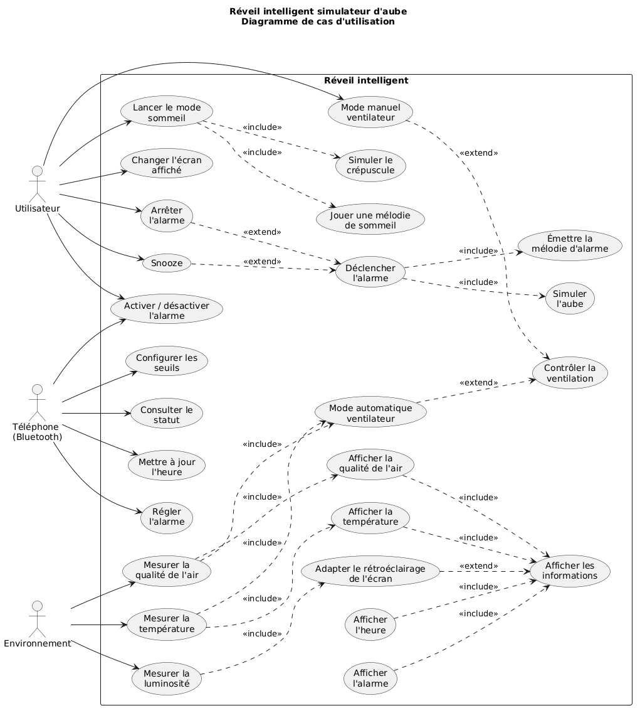

# Réveil intelligent - STM32L476 & FreeRTOS

Le projet est un réveil intelligent qui combine horloge et alarme, mesure de la température et de la qualité de l'air, ventilation automatique, éclairage d'ambiance, commandes tactiles capacitives, configuration Bluetooth, interface OLED et sons générés en PWM.

Le firmware utilise **SPI, I²C, ADC, UART, PWM, DMA, interruptions GPIO et capteurs tactiles (TSC)**. Les fonctions de l'application tournent en tâches FreeRTOS concurrentes.

---

## Fonctionnalités

- affichage de l'heure et de l'alarme sur écran OLED,
- mesure de la température (TC72),
- mesure de la qualité de l'air (SGP40, VOC),
- mesure de la luminosité ambiante (LDR) et adaptation automatique de l'affichage OLED,
- ventilation automatique ou manuelle,
- simulation de lever de soleil au déclenchement de l'alarme,
- simulation de coucher de soleil avec mélodie douce,
- sonnerie d'alarme,
- boutons tactiles Stop, Snooze et Alarme ON/OFF,
- configuration par Bluetooth.

---

## Diagramme de cas d'utilisation

Le diagramme suivant présente les principales interactions entre l'utilisateur, l'environnement, l'application mobile via Bluetooth et le réveil intelligent.




---

## Architecture

```text
Entrées                                     Sorties

TC72 (température) ── SPI2 ──┐              ┌── I2C1 ──► Écran OLED SSD1306
SGP40 (VOC) ──────── I2C1 ───┤              ├── TIM2 ───► Ventilateur
LDR ──────────────── ADC1 ───┤              ├── TIM3+DMA ► LED RGB
Potentiomètre ────── ADC1 ───┼─► STM32L476 ─┤
Bluetooth ────────── LPUART1 ┤   FreeRTOS   └── TIM8 ───► Buzzer
Touches tactiles ─── TSC ────┤
SW1 / SW2 ────────── EXTI ───┘
```

---

## Matériel

| Composant | Fonction | Interface |
|---|---|---|
| STM32L476 | Microcontrôleur | – |
| TC72 | Température | SPI2 |
| SGP40 | Qualité de l'air (VOC) | I2C1 |
| SSD1306 | Écran OLED | I2C1 |
| LDR | Luminosité ambiante | ADC1 |
| Potentiomètre | Commande manuelle du ventilateur | ADC1 |
| Module Bluetooth | Configuration à distance | LPUART1 |
| Moteur | Ventilation | TIM2 PWM + GPIO (DIR / DIS) |
| 4 LED RGB adressables | Lever / coucher de soleil | TIM3 PWM + DMA |
| Buzzer passif | Alarme et mélodie | TIM8 PWM |
| Électrodes tactiles | Stop / Snooze / Alarme ON-OFF | TSC |
| SW1 / SW2 | Boutons utilisateur | GPIO EXTI |

---

## Tâches FreeRTOS

| Tâche | Rôle |
|---|---|
| `TaskHorloge` | Incrémente l'horloge logicielle chaque seconde |
| `TaskAlarme` | Déclenche, arrête ou repousse l'alarme |
| `TaskAffichage` | Met à jour l'écran OLED |
| `TaskBluetooth` | Analyse les commandes reçues |
| `TaskTemperature` | Lit le TC72 |
| `TaskVOC` | Lit le SGP40 |
| `TaskADC` | Lit le potentiomètre et la LDR |
| `TaskVentilo` | Commande le ventilateur |
| `TaskLED` | Gère le lever et le coucher de soleil |
| `TaskMelodieSommeil` | Joue la mélodie d'endormissement |
| `TaskTouch` | Lit les touches tactiles |
| `TaskSW1` | Lance le coucher de soleil et la mélodie |
| `TaskSW2` | Change d'écran OLED |

---

## Commandes Bluetooth

Liaison LPUART1 à 9600 bauds. Chaque commande se termine par un retour à la ligne (`\r` ou `\n`).

| Commande | Effet |
|---|---|
| `heure : HH:MM:SS` | Règle l'heure |
| `alarme : HH:MM:SS` | Règle l'heure d'alarme **et l'active** |
| `alarme on` | Active l'alarme |
| `alarme off` | Désactive l'alarme |
| `temperature : X` | Seuil de température en °C (-40 à 125) |
| `voc : X` | Seuil VOC (0 à 65535) |
| `ldr : X` | Seuil LDR (0 à 4095) |
| `status` | Affiche l'heure, l'alarme et les seuils |

Exemple :

```text
heure : 21:35:00
alarme : 07:30:00
```

---


## Environnement de développement

- STM32CubeIDE / STM32CubeMX
- FreeRTOS (CMSIS-RTOS)

---

## Auteur

Mohamed Yassir IGOUZOULENE